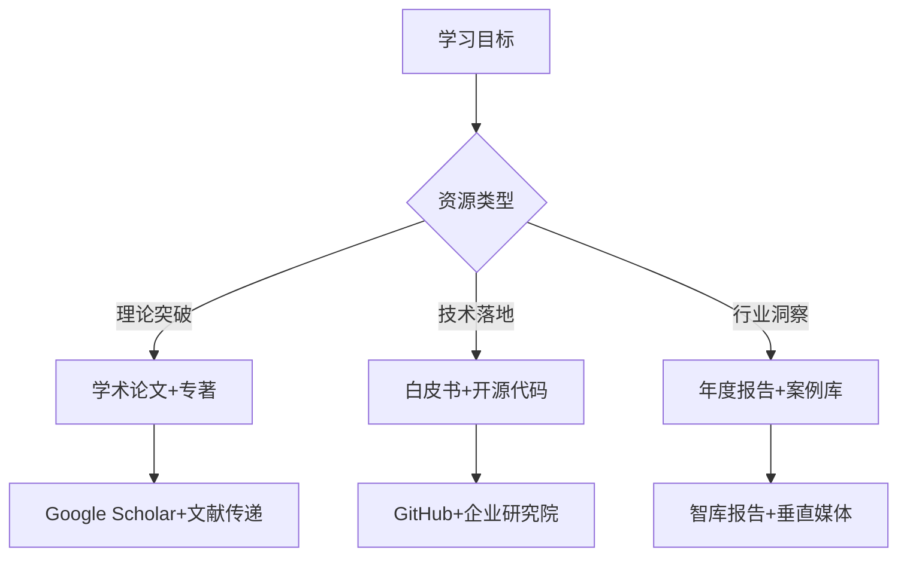

## 不错的文档收集

百度文库/道客巴巴

国外免费文库下载网址

## 软件的纯净版

没有啥广告和冗余功能

## 免费课堂

课程更加系统便于学习——尤其是刚开始接触某个学科时，由于要建立学习框架，所以优先搜集系统性的学习资料而不是零碎型的资料

系统性的学习资料——书籍，课程（与一般的视频要区分）
零散型——B站视频，博客，播客，文章等

## 灵感/顿悟

1，来源

2，对待

3，辨别：生活中的哪些东西是灵感？

4，应用：灵感的重要性体现在哪里

---

## 心法

## 框架

## 保持好奇心

## 任务切换成本

## 多任务并行成本

## 模块的后续优化及其之间联系的优化

根据你的学习需求——从精准定位行业权威到高效获取高价值资源，我结合信息可信度、获取效率及知识转化效果，为你梳理了以下渠道体系与资源组合策略：

---

### 🔍 **一、权威人物发现渠道**
#### **1. 学术与专业机构平台**
- **大学公开课平台**  
  → 中国大学MOOC（清华《柔性制造系统》）、edX（哈佛CS50）、学堂在线（工业案例解析），可系统学习专家课程体系  
  → **价值点**：附课程证书，建立知识框架基础  

- **研究机构官网**  
  → 中科院各所（如虚拟经济与数据科学中心）、华为诺亚方舟实验室（开源MindSpore教程）、隆基绿能技术白皮书  
  → **价值点**：获取一手技术文档与实验数据  

- **行业权威组织**  
  → IEEE标准库（免费下载AI伦理框架）、国家智能制造专家委员会（年刊白皮书）、ISO质量体系指南  
  → **价值点**：掌握行业标准制定逻辑  

#### **2. 动态追踪与验证工具**
- **人物搜索引擎**  
  → Spokeo（整合12亿条公共记录）、BeenVerified（反向电话查询），验证专家背景与职业轨迹  
  → **注意**：仅限公开信息查询，避免隐私侵犯  

- **公开记录数据库**  
  → 国家企业信用公示系统（查企业任职）、裁判文书网（法律关联）、知网学者库（学术影响力）  

#### **3. 社区与知识枢纽**
- **开发者社区**  
  → GitHub（跟踪PyTorch等趋势项目）、CSDN悬赏提问（解决技术卡点）  

- **知识聚合平台**  
  → 得到App《AI大模型实战》专栏（李沐团队撰写）、知乎盐选（行业洞察浓缩版）  

---

### 📚 **二、核心资源类型与获取逻辑**
#### **1. 思想精髓类（深度认知）**
- **学术论文与专著**  
  → Google Scholar订阅关键词（如“LLM fine-tuning”），自动推送最新论文  
  → 图书馆文献传递（全国图书馆参考咨询联盟，年传递200万+文献）  

- **公开演讲与访谈**  
  → TED（李飞飞《AI如何理解图像》）、一财周刊案例解读（商业逻辑图表化）  

#### **2. 实践智慧类（落地转化）**
- **技术白皮书与代码库**  
  → 英伟达开发者计划（Blackwell架构指南）、Apache基金会（Airflow工作流文档）  

- **行业解决方案**  
  → 保利投顾研究院地产日报、尚普行业数据库（2667项汽车指标）  

#### **3. 趋势预判类（前沿敏感度）**
- **年度报告与预测**  
  → Amy Webb《科技趋势报告》（预测AI自治代理风险）、GRESB能源评级（引导绿色投资）  

- **闭门分享实录**  
  → 得到App大师课（吴军《信息论40讲》）、极客时间专栏（分布式训练调参技巧）  

---

### ⚡ **三、按学习目的组合资源**

#### **场景示例：**
- **想学AI伦理** → IEEE标准库 + 哈佛《CS50》公开课 + 朱松纯“AI拥心论”演讲  
- **研究光伏技术** → 隆基BC电池白皮书 + 中科院褚君浩红外实验案例 + 行业数据库  

---

### ⚠️ **四、风险规避与效率法则**
1. **信息甄别三原则**  
   - 查来源：优先.gov/.edu域名及认证机构报告  
   - 看时效：技术类资源选3年内，政策类选最新版本  
   - 验交叉：用多个信源印证观点（如皮凯蒂数据需对比IMF报告）  

2. **合法边界警示**  
   - 禁用未授权爬虫抓取个人数据，仅用公开演讲/论文  
   - 企业敏感数据（如华为芯片设计）需通过官方渠道申请  

---

### 💎 **总结：构建“专家资源杠杆”**
> 真正高效的学习者如同**知识炼金师**——  
> - 用 **学术机构**（如中科院）提纯思想原矿 → 得**论文/专利**；  
> - 借 **企业研究院**（如英伟达）熔炼技术 → 获**代码/白皮书**；  
> - 靠 **动态追踪**（TED+年度报告）捕捉风向 → 铸**预判力**。  

**执行路径**：选定领域 → 锁定3位顶尖人物 → 深挖其著作+演讲+项目 → 交叉验证形成知识树。 例如学智能制造：李培根院士白皮书 × 任正非研发讲话 × GitHub工业机器人开源项目，三源互证，效率倍增🔥。
